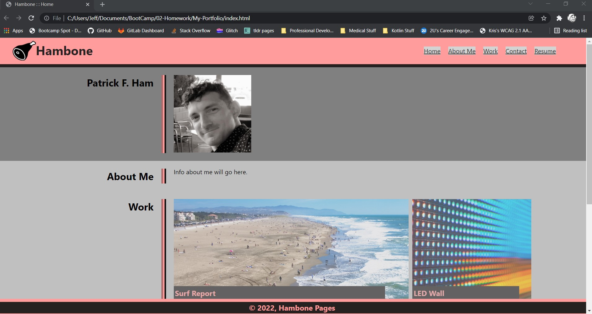
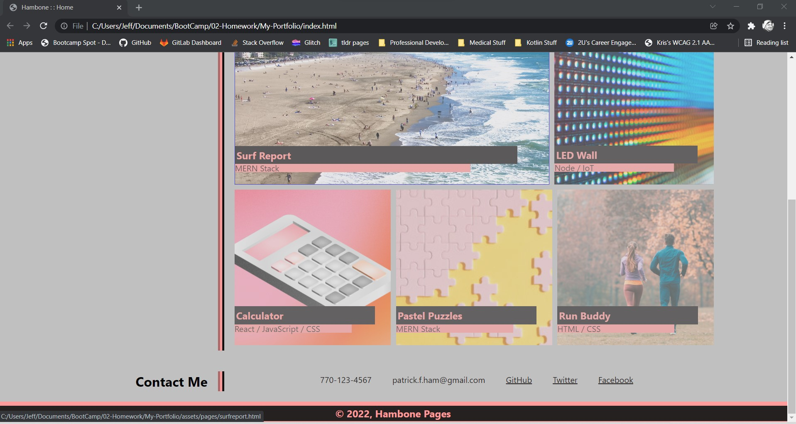

# My-Portfolio

## Description
This is an infant-version of what will become my portfolio, as a prospective employee.

## Role
I am the sole creator, designer, and developer of this portfolio.  Everything seen here is my own work.

## Screenshots 

## Video Demos
Demo of HOVER:  https://watch.screencastify.com/v/NPfVeLka3pt35Aps4zlc

Demo of RESPONSIVE: https://watch.screencastify.com/v/j351p8pWkKS8uAUXwzge

## Approach
1.  I attempted to design the HTML, almost fully, with ideas in-mind about how CSS was going to be fleshed-out.

2.  I spent an inordinant amount of time designing the flex-properties of the boxes, which of course became links to the app's we'll be designing.  The decision I made was one that shows preference to the 'function' of the flex-boxes, to be ultimately "responsive" to the viewport's size.  In its current form, I consider the headshot as contextual (in HTML), and the app-boxes' images to be decorative (in CSS).  This will change when I add actual screenshots to the app-boxes.

3.  Past that, I believe all the other criteria are met.

4.  The "tone" of this is a little silly, and likely I'll clean it up and professionalize it over time.